# RebelENGINE Completion Roadmap

## Final Goal Definition

RebelENGINE is a high-performance game and simulation engine for the RebelSUITE ecosystem. Its final goal is to provide comprehensive real-time rendering, physics simulation, AI pathfinding, animation blending, sound integration, and a modular plugin system for game development, architectural visualization, simulation, and interactive media creation.

### Key Capabilities at Completion

- High-performance real-time rendering with PBR materials and advanced lighting
- Comprehensive physics simulation including rigid bodies, soft bodies, and fluids
- Advanced animation system with blending, IK, and procedural techniques
- Spatial audio with 3D positioning and effects processing
- AI systems including pathfinding, behavior trees, and decision making
- Complete editor toolset for visual content creation
- Multi-language scripting support (Lua, Python, C++)
- Networking for multiplayer and distributed simulation
- Cross-platform support (Windows, macOS, Linux)

## Current Status Assessment

RebelENGINE is in the early stages of development, with focus on establishing the core systems and basic rendering capabilities. The current overall completion is approximately 5.5%.

### Progress by Category

| Category | Current Completion | Status |
|----------|-------------------|--------|
| Core Systems | 10% | In Progress |
| Rendering System | 15% | In Progress |
| Physics System | 5% | In Progress |
| Animation System | 5% | In Progress |
| Audio System | 5% | In Progress |
| AI Systems | 0% | Not Started |
| UI System | 5% | In Progress |
| Editor Tools | 0% | Not Started |
| Scripting System | 0% | Not Started |
| Networking System | 0% | Not Started |
| Asset Pipeline | 5% | In Progress |
| RebelSUITE Integration | 0% | Not Started |

### Key Achievements to Date

1. Basic memory management system with custom allocators
2. Core math library with vector, matrix, and quaternion operations
3. Initial event system for component communication
4. Basic rendering pipeline with shader management
5. Simple physics simulation with collision detection
6. Fundamental animation system for skeletal animation
7. Basic audio playback with spatial positioning
8. Simple UI rendering with widget system foundation
9. Initial asset loading for models and textures

### Current Challenges

1. Optimizing the rendering pipeline for performance across different hardware
2. Ensuring physics simulation stability and accuracy
3. Designing a flexible and extensible architecture for future features
4. Managing memory efficiently for complex scenes
5. Balancing feature development with performance considerations

## Detailed Completion Roadmap

The development of RebelENGINE is organized into four major phases, each with specific milestones and deliverables:

### Phase 1: Foundation (Current Phase - 15% Complete)

**Objective**: Establish the core systems and basic rendering capabilities

**Timeline**: Q1 2025 - Q2 2025 (6 months)

**Key Deliverables**:

| Deliverable | Status | Target Completion | Dependencies |
|-------------|--------|-------------------|--------------|
| Memory management system | In Progress (30%) | Week 12 | None |
| Math library | In Progress (40%) | Week 10 | None |
| Event system | In Progress (25%) | Week 14 | None |
| Threading and concurrency | In Progress (15%) | Week 16 | None |
| Input/output operations | In Progress (20%) | Week 18 | None |
| Logging and diagnostics | In Progress (35%) | Week 8 | None |
| Error handling | In Progress (20%) | Week 10 | None |
| Rendering pipeline | In Progress (30%) | Week 20 | Memory management |
| Camera system | In Progress (40%) | Week 16 | Math library |
| Lighting system | In Progress (20%) | Week 22 | Rendering pipeline |
| Shader management | In Progress (35%) | Week 18 | Rendering pipeline |
| Material system | In Progress (15%) | Week 24 | Shader management |
| Scene rendering | In Progress (25%) | Week 26 | Rendering pipeline, Camera system |
| Collision detection | In Progress (15%) | Week 22 | Math library |
| Rigid body physics | In Progress (10%) | Week 26 | Collision detection |
| Skeletal animation | In Progress (20%) | Week 24 | Math library |
| Animation blending | In Progress (10%) | Week 28 | Skeletal animation |
| Audio playback | In Progress (25%) | Week 20 | None |
| Spatial audio | In Progress (15%) | Week 24 | Audio playback |
| Widget system | In Progress (20%) | Week 22 | Rendering pipeline |
| Layout management | In Progress (15%) | Week 26 | Widget system |
| Model loading | In Progress (30%) | Week 18 | Memory management |
| Texture loading | In Progress (25%) | Week 16 | Memory management |

**Milestones**:
- M1.1: Core Systems Alpha (Week 16)
- M1.2: Basic Rendering Pipeline (Week 20)
- M1.3: Initial Physics and Animation (Week 24)
- M1.4: Phase 1 Complete / Alpha Release Readiness (Week 28)

**Current Focus**:
- Complete memory management system
- Finalize math library implementation
- Enhance event system
- Improve rendering pipeline
- Advance collision detection system

### Phase 2: Core Functionality (0% Complete)

**Objective**: Implement essential engine features and systems

**Timeline**: Q2 2025 - Q3 2025 (6 months)

**Key Deliverables**:

| Deliverable | Status | Target Completion | Dependencies |
|-------------|--------|-------------------|--------------|
| Configuration system | Not Started (0%) | Week 32 | Core systems |
| Plugin framework | Not Started (0%) | Week 36 | Core systems |
| Serialization system | Not Started (0%) | Week 34 | Core systems |
| PBR materials | Not Started (0%) | Week 38 | Material system |
| Post-processing effects | Not Started (0%) | Week 40 | Rendering pipeline |
| Particle system | Not Started (0%) | Week 44 | Rendering pipeline |
| Advanced lighting | Not Started (0%) | Week 42 | Lighting system |
| Physics constraints | Not Started (0%) | Week 38 | Rigid body physics |
| Continuous collision detection | Not Started (0%) | Week 40 | Collision detection |
| Physics materials | Not Started (0%) | Week 42 | Rigid body physics |
| Animation state machines | Not Started (0%) | Week 44 | Animation blending |
| Animation events | Not Started (0%) | Week 46 | Skeletal animation |
| Audio mixing | Not Started (0%) | Week 38 | Audio playback |
| Sound effects | Not Started (0%) | Week 40 | Audio playback |
| Audio triggers | Not Started (0%) | Week 42 | Audio playback, Event system |
| Pathfinding | Not Started (0%) | Week 46 | Core systems |
| Finite state machines | Not Started (0%) | Week 48 | Core systems |
| Navigation mesh | Not Started (0%) | Week 50 | Pathfinding |
| Text rendering | Not Started (0%) | Week 36 | Rendering pipeline |
| Input handling | Not Started (0%) | Week 38 | Event system |
| UI styling | Not Started (0%) | Week 40 | Widget system |
| Scene editor (basic) | Not Started (0%) | Week 48 | Scene rendering |
| Asset management | Not Started (0%) | Week 44 | Model loading, Texture loading |
| Property editors | Not Started (0%) | Week 46 | Widget system |
| Lua integration | Not Started (0%) | Week 50 | Core systems |
| Python integration | Not Started (0%) | Week 52 | Core systems |
| Transport layer | Not Started (0%) | Week 52 | Core systems |
| Asset optimization | Not Started (0%) | Week 46 | Asset loading |
| Asset versioning | Not Started (0%) | Week 48 | Asset loading |
| Asset hot reloading | Not Started (0%) | Week 50 | Asset loading |

**Milestones**:
- M2.1: Advanced Rendering Features (Week 40)
- M2.2: Enhanced Physics and Animation (Week 46)
- M2.3: Initial AI and Editor Tools (Week 50)
- M2.4: Phase 2 Complete / Beta Release Readiness (Week 52)

**Planned Focus**:
- Implement PBR materials and advanced lighting
- Develop physics constraints and continuous collision detection
- Create animation state machines and events
- Implement audio mixing and effects
- Begin AI pathfinding and navigation mesh
- Start development of basic editor tools
- Initiate scripting system integration

### Phase 3: Advanced Features (0% Complete)

**Objective**: Implement advanced features and optimizations

**Timeline**: Q3 2025 - Q4 2025 (6 months)

**Key Deliverables**:

| Deliverable | Status | Target Completion | Dependencies |
|-------------|--------|-------------------|--------------|
| Ray tracing | Not Started (0%) | Week 60 | Rendering pipeline |
| Global illumination | Not Started (0%) | Week 62 | Advanced lighting |
| Volumetric lighting | Not Started (0%) | Week 64 | Advanced lighting |
| Soft body physics | Not Started (0%) | Week 58 | Physics system |
| Fluid simulation | Not Started (0%) | Week 62 | Physics system |
| Cloth simulation | Not Started (0%) | Week 64 | Physics system |
| Inverse kinematics | Not Started (0%) | Week 56 | Animation system |
| Motion matching | Not Started (0%) | Week 60 | Animation system |
| Procedural animation | Not Started (0%) | Week 62 | Animation system |
| Environmental audio | Not Started (0%) | Week 58 | Audio system |
| Voice system | Not Started (0%) | Week 60 | Audio system |
| Advanced audio effects | Not Started (0%) | Week 62 | Audio system |
| Behavior trees | Not Started (0%) | Week 56 | AI system |
| Decision making | Not Started (0%) | Week 58 | AI system |
| Perception system | Not Started (0%) | Week 60 | AI system |
| Group behaviors | Not Started (0%) | Week 62 | AI system |
| Advanced scene editor | Not Started (0%) | Week 64 | Scene editor (basic) |
| Animation editor | Not Started (0%) | Week 66 | Animation system |
| Material editor | Not Started (0%) | Week 68 | Material system |
| Visual scripting | Not Started (0%) | Week 70 | Scripting system |
| Script debugging | Not Started (0%) | Week 66 | Scripting system |
| Hot reloading | Not Started (0%) | Week 68 | Scripting system |
| State replication | Not Started (0%) | Week 64 | Transport layer |
| Messaging system | Not Started (0%) | Week 66 | Transport layer |
| Network prediction | Not Started (0%) | Week 68 | Transport layer |
| RebelCAD integration | Not Started (0%) | Week 70 | Asset pipeline |
| RebelCODE integration | Not Started (0%) | Week 72 | Scripting system |
| RebelFLOW integration | Not Started (0%) | Week 74 | Visual scripting |
| Asset bundling | Not Started (0%) | Week 66 | Asset pipeline |
| Asset dependency tracking | Not Started (0%) | Week 68 | Asset pipeline |

**Milestones**:
- M3.1: Advanced Rendering Techniques (Week 64)
- M3.2: Advanced Physics and Animation (Week 66)
- M3.3: Complete Editor Toolset (Week 70)
- M3.4: Phase 3 Complete / Release Candidate Readiness (Week 76)

**Planned Focus**:
- Implement advanced rendering techniques (ray tracing, global illumination)
- Develop advanced physics (soft bodies, fluids, cloth)
- Create advanced animation systems (IK, motion matching)
- Implement advanced AI (behavior trees, perception)
- Complete editor toolset with specialized editors
- Develop comprehensive networking capabilities
- Begin RebelSUITE integration

### Phase 4: Refinement & Release (0% Complete)

**Objective**: Finalize all features, optimize performance, and prepare for release

**Timeline**: Q4 2025 - Q1 2026 (6 months)

**Key Deliverables**:

| Deliverable | Status | Target Completion | Dependencies |
|-------------|--------|-------------------|--------------|
| Performance optimization | Not Started (0%) | Week 84 | All systems |
| Memory optimization | Not Started (0%) | Week 86 | All systems |
| Cross-platform support | Not Started (0%) | Week 88 | All systems |
| Complete RebelSUITE integration | Not Started (0%) | Week 90 | Initial integrations |
| Comprehensive documentation | Not Started (0%) | Week 92 | All features |
| Example projects | Not Started (0%) | Week 94 | All features |
| Final testing | Not Started (0%) | Week 96 | All features |
| Bug fixing | Not Started (0%) | Week 100 | Testing results |
| Release preparation | Not Started (0%) | Week 102 | All deliverables |
| Final release | Not Started (0%) | Week 104 | Release preparation |

**Milestones**:
- M4.1: Performance Optimization (Week 86)
- M4.2: Cross-Platform Support (Week 90)
- M4.3: Documentation and Examples (Week 96)
- M4.4: Final Release (Week 104)

**Planned Focus**:
- Optimize performance across all systems
- Ensure cross-platform compatibility
- Complete RebelSUITE integration
- Create comprehensive documentation
- Develop example projects and templates
- Conduct thorough testing and bug fixing
- Prepare for final release

## Implementation Priority List

The following priorities guide the implementation sequence:

### Critical Path Items

1. Core systems (memory, math, events, threading)
2. Rendering pipeline and materials
3. Physics simulation with collision detection
4. Animation system with blending
5. Audio system with spatial positioning
6. UI system with widgets and layout
7. Asset pipeline for content creation
8. Editor tools for visual development
9. Scripting system for extensibility
10. Networking for multiplayer capabilities
11. RebelSUITE integration for ecosystem connectivity

### Dependencies

```mermaid
graph TD
    A[Core Systems] --> B[Rendering Pipeline]
    A --> C[Physics System]
    A --> D[Animation System]
    A --> E[Audio System]
    A --> F[UI System]
    A --> G[Asset Pipeline]
    B --> H[PBR Materials]
    B --> I[Lighting System]
    B --> J[Post-Processing]
    B --> K[Particle System]
    C --> L[Collision Detection]
    C --> M[Rigid Body Physics]
    L --> N[Physics Constraints]
    M --> O[Soft Body Physics]
    M --> P[Fluid Simulation]
    D --> Q[Skeletal Animation]
    Q --> R[Animation Blending]
    R --> S[Animation State Machines]
    Q --> T[Inverse Kinematics]
    R --> U[Motion Matching]
    E --> V[Spatial Audio]
    E --> W[Sound Effects]
    E --> X[Audio Mixing]
    V --> Y[Environmental Audio]
    F --> Z[Widget System]
    Z --> AA[Layout Management]
    Z --> AB[Input Handling]
    Z --> AC[UI Styling]
    G --> AD[Model Loading]
    G --> AE[Texture Loading]
    G --> AF[Material Import]
    G --> AG[Animation Import]
    G --> AH[Audio Import]
    A --> AI[Scripting System]
    AI --> AJ[Lua Integration]
    AI --> AK[Python Integration]
    AI --> AL[Visual Scripting]
    A --> AM[AI Systems]
    AM --> AN[Pathfinding]
    AM --> AO[Finite State Machines]
    AN --> AP[Navigation Mesh]
    AO --> AQ[Behavior Trees]
    AO --> AR[Decision Making]
    A --> AS[Networking]
    AS --> AT[Transport Layer]
    AT --> AU[State Replication]
    AT --> AV[Messaging System]
    AU --> AW[Network Prediction]
    B --> AX[Editor Tools]
    AX --> AY[Scene Editor]
    AX --> AZ[Property Editors]
    D --> BA[Animation Editor]
    H --> BB[Material Editor]
    A --> BC[RebelSUITE Integration]
    BC --> BD[RebelCAD Integration]
    BC --> BE[RebelCODE Integration]
    BC --> BF[RebelFLOW Integration]
```

## Technical Debt & Refactoring Needs

| Area | Technical Debt | Priority | Impact | Planned Resolution |
|------|---------------|----------|--------|-------------------|
| Rendering Pipeline | Current design may limit scalability for advanced features | Medium | Could impact performance with complex scenes | Phase 2: Refactor for better abstraction and extensibility |
| Memory Management | Some allocations not properly tracked | High | Memory leaks and fragmentation | Phase 1: Implement comprehensive tracking and pooling |
| Threading Model | Not fully thread-safe in all components | High | Race conditions and crashes | Phase 1: Audit and implement proper synchronization |
| Shader Management | Hard-coded shader paths and parameters | Medium | Limits flexibility and portability | Phase 2: Implement data-driven shader system |
| Physics Integration | Tight coupling with rendering | Medium | Difficult to maintain and extend | Phase 2: Create better abstraction layer |
| Asset Loading | Synchronous loading blocks main thread | Medium | Performance issues with large assets | Phase 2: Implement async loading system |

## Integration Testing Plan

### RebelCAD Integration

- **Testing Focus**: Model import, CAD-specific data preservation
- **Test Cases**: 
  1. Import complex CAD models with hierarchical structure
  2. Preserve material properties from CAD models
  3. Handle large-scale architectural models
  4. Maintain precision for engineering simulations
- **Timeline**: Phase 3, Weeks 70-74

### RebelCODE Integration

- **Testing Focus**: Scripting integration, code-driven engine control
- **Test Cases**:
  1. Execute scripts to control engine components
  2. Debug scripts during runtime
  3. Profile script performance
  4. Hot reload scripts during execution
- **Timeline**: Phase 3, Weeks 72-76

### RebelFLOW Integration

- **Testing Focus**: Visual scripting, workflow automation
- **Test Cases**:
  1. Create game logic with visual scripting
  2. Automate asset processing workflows
  3. Create interactive simulations
  4. Build AI behavior systems
- **Timeline**: Phase 3, Weeks 74-78

### RebelDESK Integration

- **Testing Focus**: Development environment integration
- **Test Cases**:
  1. Edit engine assets from RebelDESK
  2. Debug engine execution from IDE
  3. Profile engine performance from IDE
  4. Deploy projects from IDE
- **Timeline**: Phase 3-4, Weeks 76-80

### RebelSCRIBE Integration

- **Testing Focus**: Documentation generation, in-engine help
- **Test Cases**:
  1. Generate API documentation from engine code
  2. Create in-engine help system
  3. Document engine components and systems
  4. Create tutorials and guides
- **Timeline**: Phase 3-4, Weeks 78-82

### Cross-Component Integration

- **Testing Focus**: End-to-end workflows across multiple components
- **Test Cases**:
  1. CAD model to game asset pipeline
  2. Code-driven simulation with visual workflow
  3. Documentation generation for custom engine extensions
  4. Cross-component debugging and profiling
- **Timeline**: Phase 4, Weeks 82-90

## Release Criteria

### Alpha Release (30% Completion)

- Core Systems: 70% complete
- Rendering System: 60% complete
- Physics System: 40% complete
- Animation System: 40% complete
- Audio System: 40% complete
- UI System: 50% complete
- Asset Pipeline: 50% complete
- All critical bugs fixed
- Basic functionality working end-to-end

### Beta Release (60% Completion)

- Core Systems: 90% complete
- Rendering System: 80% complete
- Physics System: 70% complete
- Animation System: 70% complete
- Audio System: 70% complete
- AI Systems: 50% complete
- UI System: 80% complete
- Editor Tools: 60% complete
- Scripting System: 70% complete
- Networking System: 50% complete
- Asset Pipeline: 80% complete
- RebelSUITE Integration: 40% complete
- No critical bugs
- Performance meeting 80% of targets

### Release Candidate (90% Completion)

- All categories at minimum 80% complete
- Critical features 100% complete
- No known critical bugs
- Performance metrics meeting targets
- All planned integrations functional
- Documentation 90% complete
- All tests passing

### Final Release (100% Completion)

- All planned features implemented
- All tests passing
- Documentation complete
- Performance targets met
- All integrations thoroughly tested
- Example projects complete
- User acceptance testing complete
- No known bugs of medium or higher severity

## Performance Metrics

| Metric | Target | Current | Status |
|--------|--------|---------|--------|
| Rendering performance | 60+ FPS for complex scenes | ~30 FPS | In progress |
| Physics simulation | 1000+ rigid bodies at 60 FPS | ~200 bodies | In progress |
| Animation blending | 10+ animations at 60 FPS | ~3 animations | In progress |
| Memory usage | < 1GB for typical scenes | ~1.5GB | Needs optimization |
| Loading times | < 5 seconds for typical scenes | ~12 seconds | Needs optimization |
| Streaming performance | Seamless world streaming | Not implemented | Not started |
| Audio channels | 64+ simultaneous sounds | ~16 channels | In progress |
| Script execution | < 1ms for typical scripts | Not measured | Not started |
| Network bandwidth | < 100KB/s per client | Not measured | Not started |
| Asset import speed | < 10 seconds for typical assets | ~25 seconds | Needs optimization |

## Next Steps

1. **Complete Core Systems (Next 4 Weeks)**
   - Finalize memory management system
   - Complete math library implementation
   - Enhance event system
   - Improve threading model
   - Implement serialization system

2. **Advance Rendering System (Next 6 Weeks)**
   - Enhance rendering pipeline
   - Implement PBR materials
   - Improve lighting system
   - Develop shader management
   - Implement scene graph

3. **Develop Physics System (Next 8 Weeks)**
   - Enhance collision detection
   - Improve rigid body simulation
   - Implement constraints
   - Begin soft body physics research
   - Develop physics debugging tools

4. **Enhance Animation System (Next 10 Weeks)**
   - Improve skeletal animation
   - Implement animation blending
   - Begin inverse kinematics research
   - Develop animation debugging tools
   - Implement animation events

5. **Improve Audio System (Next 6 Weeks)**
   - Enhance spatial audio
   - Implement sound effects processing
   - Improve music playback
   - Begin audio mixing implementation
   - Develop audio debugging tools

---

*Last Updated: 2025-03-19*
*Note: This is a living document that should be updated as development progresses.*
